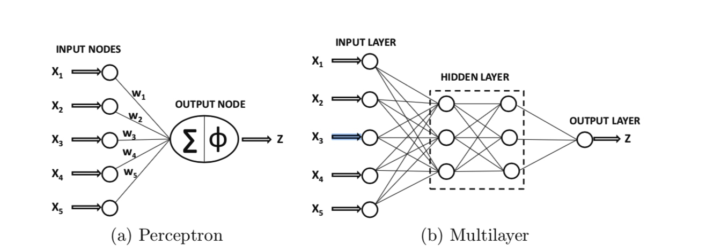
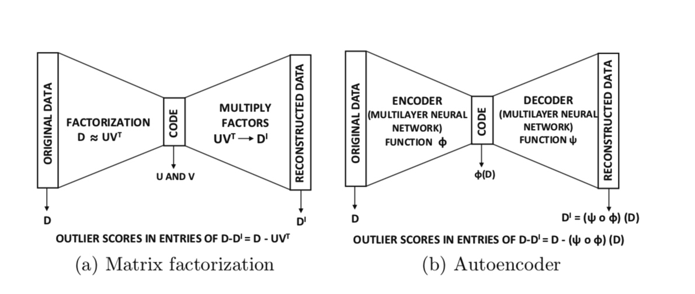

[TOC]

# 算法原理
自编码器是一种非监督的神经网络，目的是学到数据的有用的表达形式。跟PCA一样，自编码器也可以用于检测异常。






# 训练参数简化


# 应用参数抽象


# 异常检测算法使用实例

1. 学习正常模式(train)

2. 检测异常（detect/predict+detect）

3. 将异常可视化(visualize)


下面是使用auto encoder进行异常检测的一段代码:

```python
    # 1) LEARN WHAT'S NORMAL
    # train unsupervised Deep Learning autoencoder model on train_hex
    ae_model = deeplearning(x=train[predictors], training_frame=train, activation="Tanh", autoencoder=True,
                                hidden=[50], l1=1e-5, ignore_const_cols=False, epochs=1)

    # 2) DETECT OUTLIERS
    # anomaly app computes the per-row reconstruction error for the test data set
    # (passing it through the autoencoder model and computing mean square error (MSE) for each row)
    test_rec_error = ae_model.anomaly(test)

    # 3) VISUALIZE OUTLIERS
    # Let's look at the test set points with low/median/high reconstruction errors.
    # We will now visualize the original test set points and their reconstructions obtained
    # by propagating them through the narrow neural net.
    # Convert the test data into its autoencoded representation (pass through narrow neural net)
    test_recon = ae_model.predict(test)
    # In python, the visualization could be done with tools like numpy/matplotlib or numpy/PIL
```


# 参考文献
[1] (Chapter 3) Charu C Aggarwal. Outlier analysis. In Data mining, 75–79. Springer, 2015.


