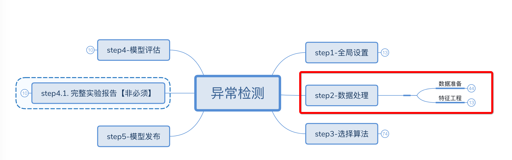
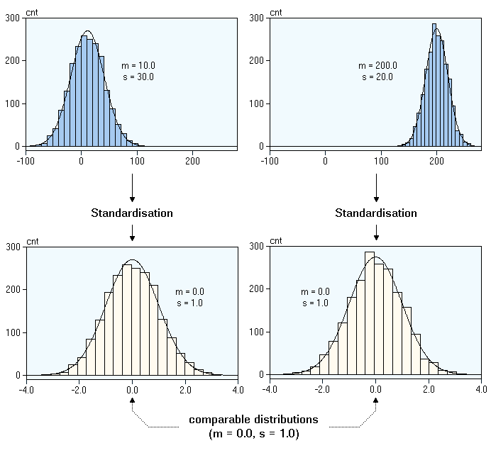
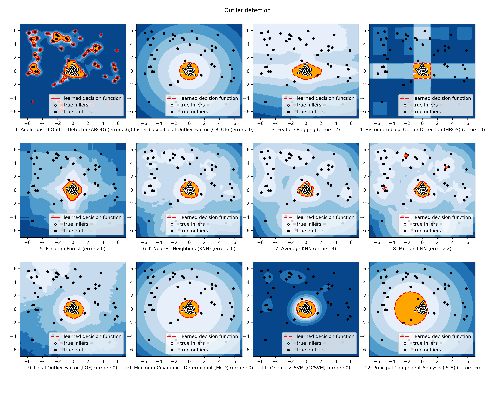
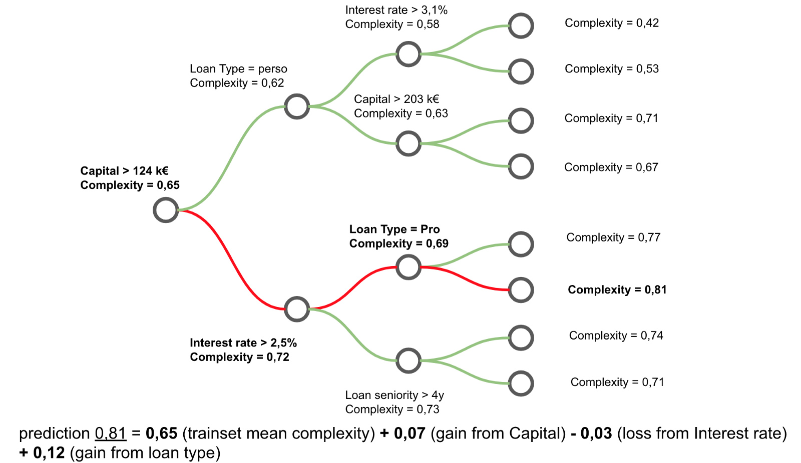
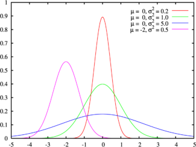
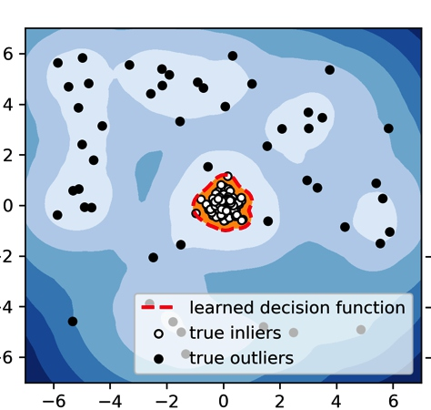

[TOC]
为了降低用户使用Modelflow构建模型的门槛，Modelflow提供算法原理可视化的工具和文档，方便用户快速理解算法，以及根据数据的分布和其他性质来选择算法。


# 1. 数据处理-选择样本库


## 1.1 切分数据集

设置数据集切分比例的地方，显示切分之后，前面一截时序是训练集，后面一截时序是验证集。


## 1.2 字段设置
在流程化建模的第一步-全局设置处，字段设置这里，为了方便用户理解, 加上示例数据的截图，如下图示：


# 2. 数据处理-预处理和特征工程



## 2.1 数据准备

### 2.1.1 数据准备-时序采样

### 2.1.2 数据准备-异常值填充


### 2.1.3 数据准备-标准化


- 基于场景

下图中，第一个图是原始的时序图，横轴表示时间，纵轴表示取值，可以看到原始的区在在180~900之间。

经过标准化之后，这根曲线的取值会集中在0附近。

做标准化处理，就是对曲线的值进行缩放，落入同一个量岗范围，从而使得不同的曲线都具有可比性。


算法原理的可视化





## 2.2 特征提取-加载特征库

文档

[场景可视化]

加载特征库是一种特征提取的方法。平台提供的特征库包含了一系列通用的时序特征的名称，用户可以根据数据的特性来选择计算的特征列表，从而完成特征提取。在整个过程中，用户不用自己实现计算逻辑。同时为了降低用户使用门槛，modelflow会提供单个特征对应的原理图和文档，供用户参考。

如：滑动平均


[算法原理可视化]

没有

## 2.3 特征转换-PCA

[原理可视化]


[场景可视化]


# 3. 算法


本期计划开发四个算法可视化功能，分别是
- DBSCAN
- 高斯检测
- 滑动平均
- 指数加权滑动平均
- gbdt


####  3 训练结果可视化
在机器学习算法完成训练之后，Modelflow提供需要将训练结果可视化，方便**专业用户**理解和调试模型.对于异常检测场景，Modelflow提供如下的可视化图表：

* 热力图: 对于异常检测非监督算法，Modelflow输出决策边界，即异常分值的等高线。

  

* 树状图：决策树/随机森林/孤立森林/gbdt

  对于tree-based模型，Modelflow提供树状的可视化工具(老版的modelflow已经开发，放在算法节点的评估结果里面)。




### 场景可视化-异常检测场景

针对时间序列异常检测场景，该算法可以输出异常分以及检测出是否异常的结果。

如下图所示，横轴表示时间，蓝色的周期性波动曲线表示检测的指标，

橙色的曲线表示算法输出的该时刻曲线取值的异常程度

黑色的点表示算法检测出来的异常点，可以看到，当橙色的曲线上的点即异常分值超过了某个阈值之后，

该时刻的点就被判断为异常。


### 训练-参数简化

Modelflow对自身提供的算法节点，会以提示的形式给用户推荐超参。对应原有Modelflow的参数说明和高级参数的功能。

DBSCAN的两个核心参数
- 1. epsilon: 邻域的大小。
-  2. minPoints: core-point附近邻居的个数.

### 应用-敏感度

k表示邻居个数，density计算的是x的k邻近密度，离附近k个邻居的平均距离的导数。

异常分值是density的导数。

$density(x, k) = \{\frac{1}{k}\sum\limits_{y\in N(x, k)} distance(x, y)\}^{-1}$

$score = \frac{\sum\limits_{y\in N(x, k)} distance(x, y)}{k}$

应用参数抽象是 构造 从score的范围 到[0, 1]的映射, 构造映射的通用方法是使用quantile function:

假设$F(x) \in [0,1]$是x的累计分布函数，那么他的逆函数$F^{-1}(\alpha)$就是quantile function。

输入分位数，该函数输出原始空间对应的分布值。

实际上也是一个fit_transform的节点。

首先要搜集异常得分集合，然后估计$F(x)$的参数，那么可以算出$F^{-1}(\alpha)$的解析形式，然后

这就构造了一个敏感度到是否异常的映射

$IsAnomaly = sgn(score  - F^{-1}(\alpha))$

http://courses.washington.edu/css581/lecture_slides/18_anomaly_detection.pdf

## 高斯分布检测器

### 算法原理-文档

如果随机变量X服从均值为$\mu$，方差为$\sigma^2$的高斯分布，即$X～N(\mu,\sigma^2)$高斯分布,则高斯分布的密度函数为:

${\displaystyle f(x)={1 \over \sigma {\sqrt {2\pi }}}\,e^{-{(x-\mu )^{2} \over 2\sigma ^{2}}}}$

该分布图以$x=\mu$对称，$\sigma$决定了曲线的陡峭程度，如下图所示：


当样本特征服从高斯分布，我们可以用正态分布来对数据进行异常检测，流程可以分为三步：
（1）特征选择：符合高斯分布或能转换为高斯分布的特征；
（2）参数估计：计算数据分布的均值和方差；
（3）异常诊断：选定阈值$\epsilon$，把概率密度函数值小于某个阈值的点判定为异常，即$f(x)<\epsilon$的点诊断为异常点。$\epsilon$可以动态选择。例如经典的3-sigma方法是选取了累积概率密度函数约为99.7%时对应的数值，我们也可依据先验经验，确定N-sigma中N的取值值来确定阈值.不同的n对应着不同的正常值比例。
上界：$ UCL =\mu+N*\sigma$
下界：$ LCL =\mu-N*\sigma$

如下图：


### 场景可视化-异常检测场景


如下图所示，滚动条的值是检测算法的N，对应异常分值的阈值，灰色区域是检测算法的正常区间，红色点是检测出的异常点。

向右拖动滚动条时，对应检测算法的N值变大，上下界更宽松，意味着更少的点被划分到异常区间。

可以看到右图-概率密度图中，异常区域变小，即更多的样本点落在了正常区间中。

使用：设定敏感度为n-sigma中的n，则异常检测的上界为$\mu+n*\sigma$,下界为$\mu-n*\sigma$，中间线为均值$\mu$。当数据超过上下界范围时，被检测为异常点。

向右拖动敏感度，敏感度n变大，上下界远离中线，异常点占比减少。


### 训练-参数简化

训练阶段参数简化：
**标准差倍数**：整数，取值范围为[1,n],标准差倍数决定了正常值占总数的比例。标准差倍数越大，正常值占比越大，异常值占比越小。1倍，2倍，3倍标准差决定的正常值比例分别为68%，95%，99.7%。

### 应用-敏感度

设定应用阶段敏感度$\epsilon$为N-sigma中的N的函数

​									$$\epsilon = e^{-N}$$

则异常检测的上界为$\mu+log(\frac{1}{\epsilon})*\sigma$,下界为，中间$\mu+log(\frac{1}{\epsilon})*\sigma$,基线为均值。当数据超过上下界范围时，就被检测为异常点。

敏感度 $\epsilon$ 越小，上下界越靠近中线，正常值比例越低，异常值比例越高。

## EWMA
### 算法原理-文档

EWMA是指数加权滑动平均的简称，该方法也是异常检测的一个常用算法。原理是先对原始时序进行指数平滑，得到下一个时刻的置信区间（也就是上下界），当下一个样本点超出置信区间，则判断为异常。主要步骤为：

（1）**指数平滑**

对数据进行指数平滑处理，处理公式为：$EWMA_t=\lambda Y_t+(1-\lambda)EWMA_{t-1}$，其中：

- $EWMA_0$是历史数据的均值；
- $Y_t$是t时刻的观测值；
- n是数据总量；
- $\lambda$是一个参数，决定算法对历史数据的依赖程度， $0<\lambda<1$。$\lambda$越接近于1，历史数据的权重越小，当前时刻的权重越大。

（2）**异常检测**

EWMA 的估算方差为，$s^2_{ewma}=\frac{\lambda}{2-\lambda}s^2$,其中s为历史上历史数据的标准差；

则异常检测的上下界为：

上界：$UCL =EWMA_0+k*s_ {ewma}$

下界：$LCL =EWMA_0-k*s_{ewma}$

当数据超过上下界范围时，就被检测为异常点。其中$k$为常量，一般取值为3。$k$的取值决定了上下界的范围及异常值的比例。$k$越小，上下界越靠近中线，正常值比例越低，异常值比例越高。

下面举例说明计算过程:

**数据预览**：

```
52.0 47.0 53.0 49.3 50.1 47.0
51.0 50.1 51.2 50.5 49.6 47.6
49.9 51.3 47.8 51.2 52.6 52.4  53.6 52.1
```

**指数平滑**：

$EWMA_0$=50，选择$\lambda=0.3$,对数据进行指数平滑后，数据为：

```
50.00 50.60 49.52 50.56 50.18
50.16 49.21 49.75 49.85 50.26
50.33 50.11 49.36 49.52 50.05
49.38 49.92 50.73 51.23 51.94 51.99
```

**异常检测**：

$s^2_{ewma}=\frac{\lambda}{2-\lambda}s^2=\frac{0.3}{2-0.3}*2.0539$,，则$s_{ewma}=0.6039$,则上下界为：

$UCL=50+3(0.4201)(2.0539)=52.5884$

$LCL =50-3(0.4201)(2.0539)=47.4115$

效果图如下：


### 场景可视化-异常检测场景


### 训练-参数简化

训练阶段参数简化：

衰减因子$\lambda$，其值介于0与1之间﹐表示EWMA对于历史量测值之权重系数。$\lambda$越接近于1，历史数据的权重越小，当前时刻的权重越大。

### 应用-敏感度

设定应用阶段敏感度$\epsilon$等于标准差倍数$k$，则异常检测的上界为$\mu+\epsilon*\sigma$,下界为$\mu-\epsilon*\sigma$，中间线$\mu=EWMA_0$,即历史数据的均值，$\sigma$为EWMA的标准差。当数据超过上下界范围时，就被检测为异常点。敏感度越小，上下界越靠近中线，正常值比例越低，异常值比例越高。


## MovingAverage

MA是滑动平均的简称，该方法也是异常检测的一个常用算法。原理是先对原始时序进行滑动平均，得到下一个时刻的置信区间（也就是上下界），当下一个样本点超出置信区间，则判断为异常。

### 算法原理-文档

算法主要步骤为：

（1）**滑动平均**

计算方法：对于一个给定的数列，首先设定一个固定的滑动窗口长度w，然后分别计算第1项到第w项，第2项到第w+1项，第3项到第w+2项的平均值，依次类推。

（2）**异常检测**

在对原始数据进行滑动平均后，异常检测的上下界为：

上界：$UCL =\mu_0+\frac{k\sigma}{\sqrt{w}}$

下界：$LCL =\mu_0-\frac{k\sigma}{\sqrt{w}}$

当数据超过上下界范围时，就被检测为异常点。其中$\mu_0$为历史数据的均值,$\sigma$为历史数据的标准差，$w$为滑动窗口的长度，$k$为常量，一般取值为3。$k$的取值决定了上下界的范围及异常值的比例。$k$越小，上下界越靠近中线，正常值比例越低，异常值比例越高。

###  场景可视化-异常检测场景


### 训练-参数简化

训练阶段参数简化：

滑动窗口长度$w$。$w$越大，噪声被去除的就越多，得到的信号就越平稳；但同时，信号的有用部分丢失原有特性的可能性就越大。

### 应用-敏感度

设定应用阶段敏感度$\epsilon$等于标准差倍数$k$，则异常检测的上界为$\mu_0+\frac{k\sigma}{\sqrt{w}}$，下界为$\mu_0-\frac{k\sigma}{\sqrt{w}}$中间线$\mu=\mu_0$,即历史数据的均值，$\sigma$为MA的标准差，$w$为滑动窗口的长度。当数据超过上下界范围时，就被检测为异常点。敏感度越小，上下界越靠近中线，正常值比例越低，异常值比例越高。

# 4 模型评估


在模型评估阶段， 我们提供两种工具

## 4.1 结果概览

### 4.1.1 评估曲线


###  4.1.2 评估指标
- 分类的评估指标[带标签的数据]【】：acurracy/precision/recall/fscore/lift/ log loss/auc/confusion matrix
- 检测结果的时序图【贴场景】
   
   图片中包含的元素有：
   上下界/基线/异常分值/异常标记/检出异常的个数与比例
   检出异常的个数与比例[待开发]


### 4.1.3 交互式调阈值
对于有标记的样本，用户通过调整pr曲线上的值/异常分值的分位数/准确率/recall，来实时的修正检测结果。

对于没有标记的样本，用户通过调整异常分值的分位数，来实时修正检测结果。


以及动态展示评估指标：


## 4.2 模型详情

### 4.2.1 训练过程可视化

- 损失函数

  对于复杂算法或者对比实验，平台提供中间数据的可视化，以便用户了解模型训练的进度，进而决定不要提前终止实验。

  1. 

- 特征重要性

对于训练过程中，Modelflow实时展示特征的重要性。


### 4.2.2 训练结果可视化

除了上一节的模型评估指标，如果用户想知道关于模型的更多信息，Modelflow也提供如下的图形分析工具：

- 不同参数设置对结果的影响：用户在使用对比试验的功能时，modelflow将所有调参尝试的结果存储起来，对每组实验的参数进行可视化，以方便管理和查看不同超参数训练出来的模型效果。下面的平行坐标图是一种最常用的图形分析工具: 通过将每一次运行的参数组抽象成一根折线、每一个参数抽象成一根轴、平行展示所有参数的方式，快速展示出工具尝试运行过的所有参数组。

  - 平行坐标图

    

- 单个算法训练结果：用户想对单个训练完的模型详情进行研究，我们也提供针对单个算法的可视化功能。

  - 热力图: 异常检测的非监督算法。
  
  - 树状图：决策树/随机森林/孤立森林/gbdt，如下图：
    


# 5. 参考资料
1. M. M. Breunig, H. P. Kriegel, R. T. Ng, J. Sander. LOF: Identifying Density-based Local Outliers. SIGMOD, 2000.
2. M. Goldstein. FastLOF: An Expectation-Maximization based Local Outlier detection algorithm. ICPR, 2012
3. https://en.wikipedia.org/wiki/Local_outlier_factor
4. http://scikit-learn.org/stable/modules/outlier_detection.html
5. Aggarwal, C.C., 2015. Outlier analysis. In Data mining (pp. 237-263). Springer, Cham.
6. http://odds.cs.stonybrook.edu/#table1, 异常检测数据集
7. https://github.com/aurotripathy/lstm-anomaly-detect
8. https://github.com/Vict0rSch/deep_learning
9. https://github.com/scikit-learn/scikit-learn/blob/f0ab589f/sklearn/covariance/outlier_detection.py#L22
10. Outlier Detection Using Replicator Neural
  Networks， Simon Hawkins, Hongxing He, Graham Williams and Rohan Baxter
11. http://courses.washington.edu/css581/lecture_slides/18_anomaly_detection.pdf
12. http://mbostock.github.io/protovis/ex/cars.html