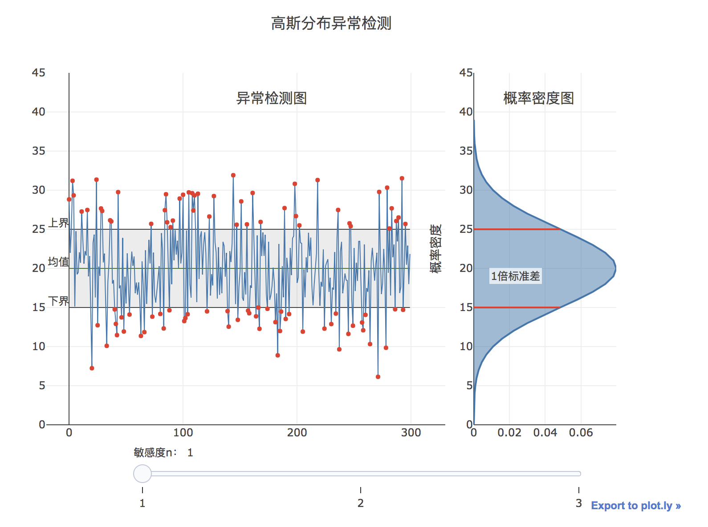
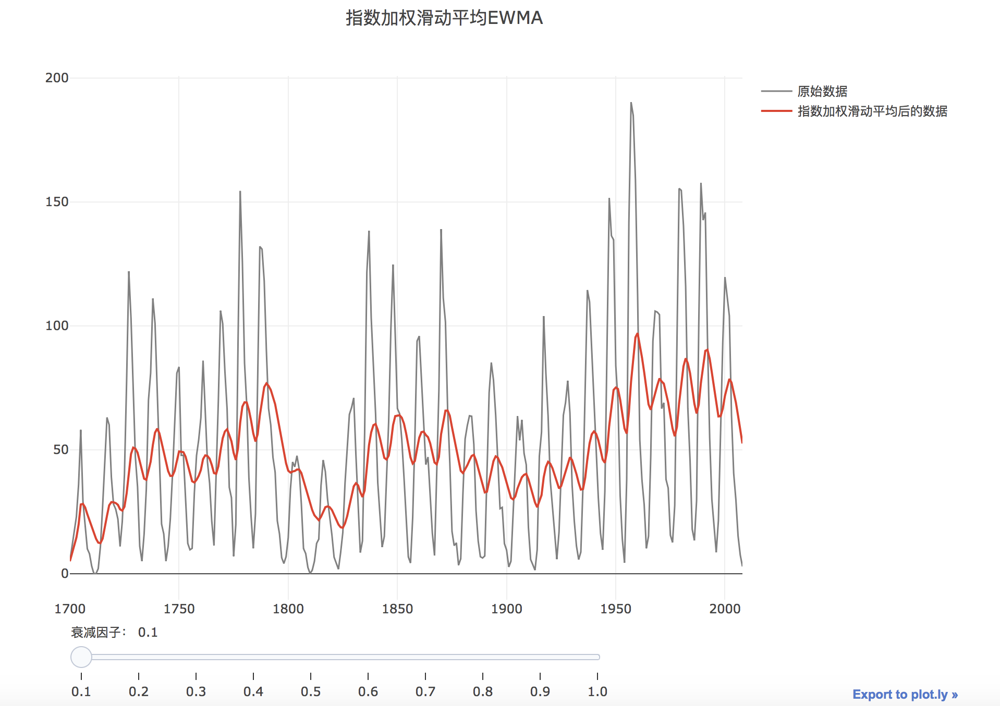
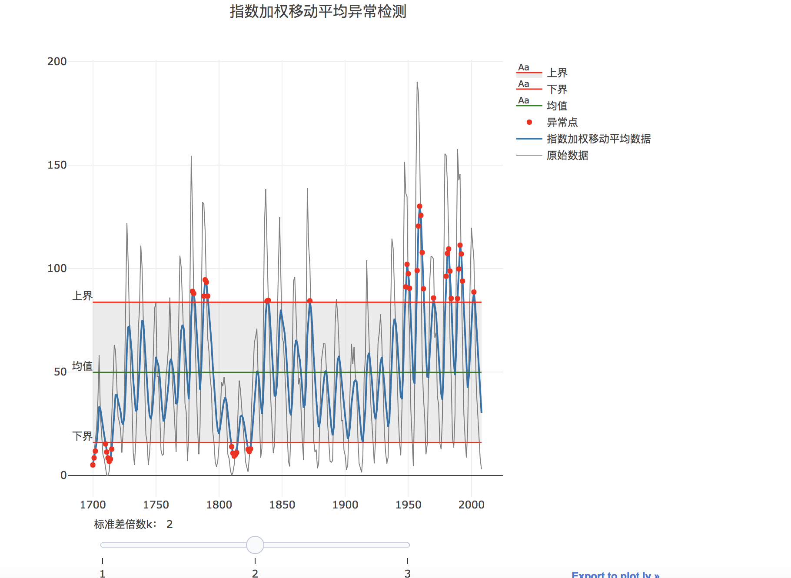

[TOC]

## 1高斯分布

当样本特征服从高斯分布（即正态分布），我们可以用正态分布来对数据进行异常检测，流程为：

（1）特征选择：符合高斯分布或能转换为高斯分布的特征；

（2）参数估计：计算数据分布的均值和标准差；

（3）异常诊断：选定阈值，把概率密度函数值小于某个阈值的点判定为异常，即的点诊断为异常点。

如下：设定敏感度为n-sigma中的n，则异常检测的上界为$\mu+n*\sigma$,下界为$\mu-n*\sigma$，中间线为均值$\mu$。当数据超过上下界范围时，被检测为异常点。

向右拖动敏感度，敏感度n变大，上下界远离中线，异常值比例降低。

## 2 滑动平均

滑动平均简称为MA。原理是先对原始时序进行滑动平均，得到下一个时刻的置信区间（也就是上下界），当下一个样本点超出置信区间，则判断为异常。主要步骤为：

（1）**滑动平均**

计算方法：对于一个给定的数列，首先设定一个固定的滑动窗口长度w，然后分别计算第1项到第w项，第2项到第w+1项，第3项到第w+2项的平均值，依次类推。

如下：向右拖动滑动窗口长度w，w变大，噪声被去除的就越多，得到的曲线就越平稳；但同时，曲线的有用部分丢失原有特性的可能性就越大。

（2）**异常检测**

在对原始数据进行滑动平均后，异常检测的上下界为：

上界：$UCL =\mu_0+\frac{k\sigma}{\sqrt{w}}$

下界：$LCL =\mu_0-\frac{k\sigma}{\sqrt{w}}$

当数据超过上下界范围时，就被检测为异常点。其中$\mu_0$为历史数据的均值,$\sigma$为历史数据的标准差，$w$为滑动窗口的长度，$k$为常量，一般取值为3。

如下：在对数据做滑动平均处理后，设置敏感度为标准差数k，拖动标准差倍数滑动条向右，k变大，上下界远离中线，异常值比例降低。

## 3 EWMA指数加权移动平均

指数加权滑动平均简称为EWMA，原理是先对原始时序进行指数平滑，得到下一个时刻的置信区间（也就是上下界），当下一个样本点超出置信区间，则判断为异常。主要步骤为：

（1）**指数平滑**

对数据进行指数平滑处理，处理公式为：$EWMA_t=\lambda Y_t+(1-\lambda)EWMA_{t-1}$，其中：

- $EWMA_0$是历史数据的均值；
- $Y_t$是t时刻的观测值；
- n是数据总量；
- $\lambda$是一个参数，决定算法对历史数据的依赖程度， $0<\lambda<1$。$\lambda$越接近于1，历史数据的权重越小，当前时刻的权重越大。

如下：向右拖动衰减因子滑动条，$\lambda$变大，对历史数据依赖越小，当前数据的权重越大，处理后的曲线越接近原始曲线。

（2）**异常检测**

EWMA 的估算方差为，$s^2_{ewma}=\frac{\lambda}{2-\lambda}s^2$,其中s为历史上历史数据的标准差；

则异常检测的上下界为：

上界：$UCL =EWMA_0+k*s_ {ewma}$

下界：$LCL =EWMA_0-k*s_{ewma}$

其中$EWMA_0$是历史数据的均值，k为标准差倍数，一般取值为3。

如下：在对数据做指数加权滑动平均处理后，设置敏感度为标准差数k，拖动标准差倍数滑动条向右，k变大，上下界远离中线，异常值比例降低。

