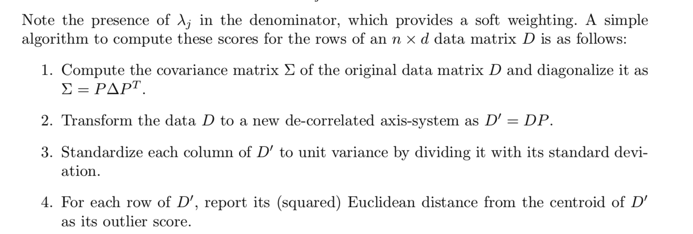

[TOC]

# 1. 算法原理

主成分分析是一种常见的

主成分分析(PCA)是一种在数据集中强调变化和产生强模式的技术。它通常用于使数据易于浏览和可视化。

2维空间中的实例

# 2.1 【补】跟马氏距离的联系
在原始空间中计算样本点（row）到中心点（使用的是总体样本的中心点）马氏距离是使用pca计算异常得分的一个特例，pca是通过计算新的（d-k维）子空间中对各个坐标轴上样本点离中心欧式距离的加权求和来计算异常得分的。
马氏距离计算异常得分：
$\operatorname { Score } ( \overline { X } ) = \sum \limits_ { j = 1 } ^ { d } \frac { \left| ( \overline { X } - \overline { \mu } ) \cdot \overline { e _ { j } } \right| ^ { 2 } } { \lambda _ { j } }$

具体的算法步骤如下：

# 3. 参考文献
[1] Aggarwal, C.C., 2015. Outlier analysis. In Data mining (pp. 237-263). Springer, Cham.
