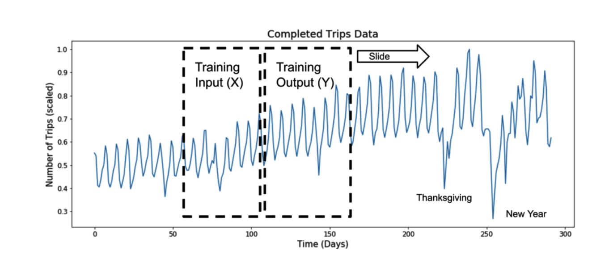
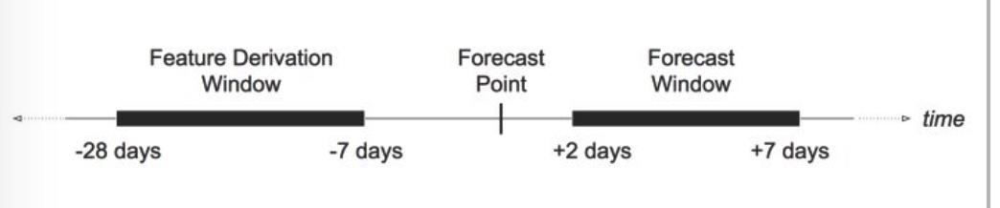
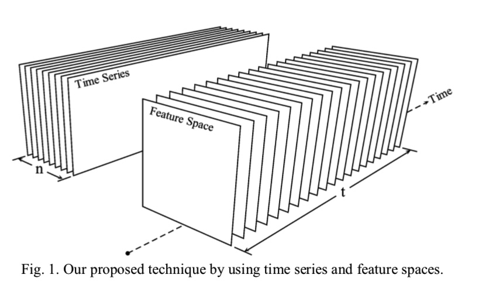

## 基于滑窗的方法
在每一个时刻，可以利用之前的所有信息来计算该时刻的特征，以下图为例：

通过不断的滚动窗口，提取某个时间点前置窗口的数据作为该样本点的特征：
当$f$为恒等变换时，即$$f(X_t) =X_t，  R^{w} ->  R^{w},  $$时，就是将前置窗口的原始数据作为输入，构造的长度为w的特征向量。
${X_t} = [y_{t-w},\dots,y_{t-1}, y_{t}]$
$F_t = f(X_t)$ 
这里t是时间戳,$F_t$是该时间点的特征向量。
f是特征提取的函数，具体的函数可以参考下一章节。

### 时序预测场景举例

以预测模型为例，假设希望预测未来一周的值，可利用的历史数据有3周，
这里如果使用基于滑动窗口的方式提取特征，窗口的长度就是3周（feature derivation window), 在这个窗口中，可以提取波动率，均值，滞后项等特征，用来预测未来1周的值。

## 时序模式变换
除了对原有的时间序列构造新的特征，通常也会对原始时序做一些变换得到新的序列，然后在新序列进行分析，常用的变换方法有
- 对数表换
- 周期性差分
- 简单的一阶差分
- box-cox变换

## 时间相关的变量
对于每一个时间戳，可以提取跟时间本身相关的信息，如月份，时刻等：
- 每天的第多少分钟
- 每天的哪个时刻
- 是否是工作时间
- 是否是周末
- 季节
- 是否是公共节假日
- 是否是闰年

这些特征是根据具体的应用场景设计，

## 总结
在通过模式变换后，可以得到多条时间序列曲线，对每一条曲线可以提取特征，组合得到最终的特征空间.

