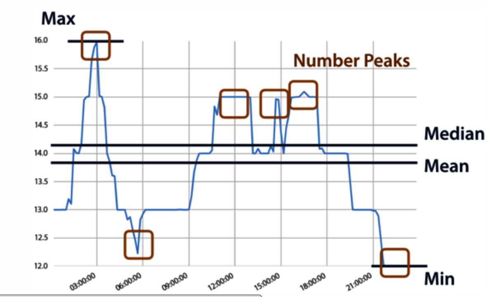
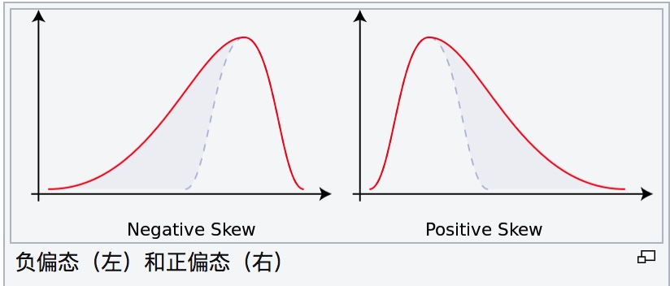
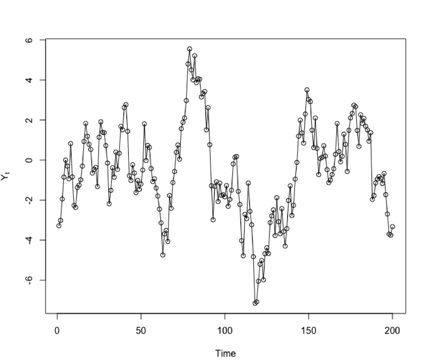
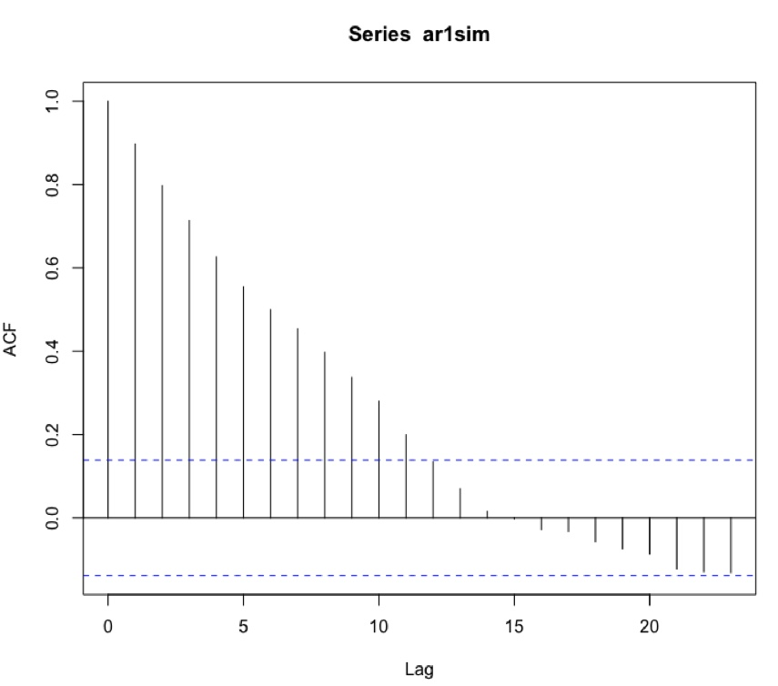
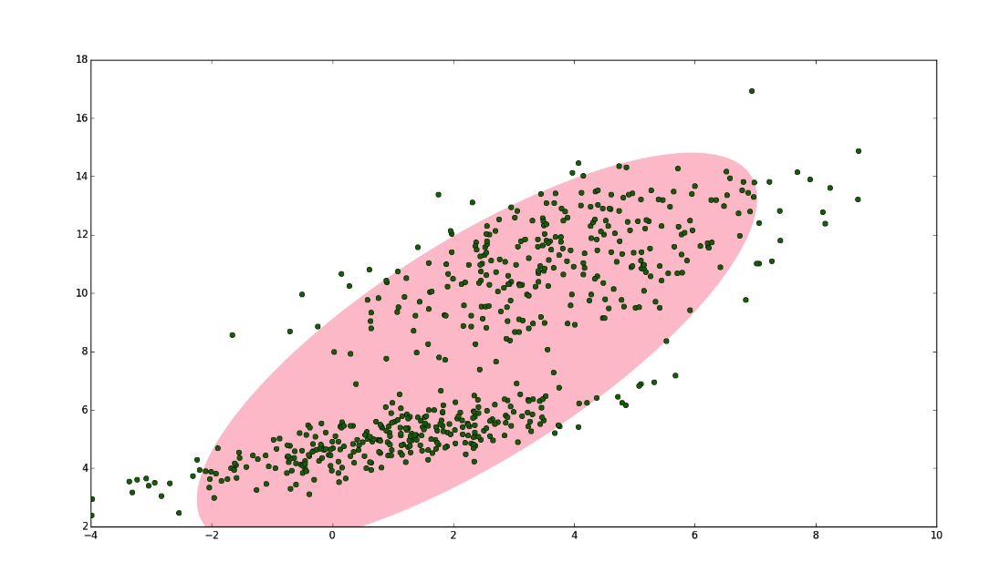
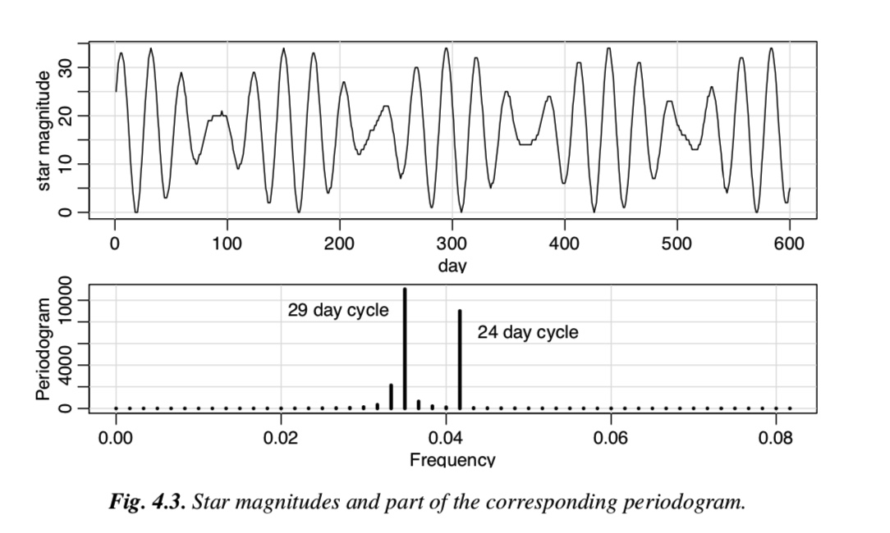
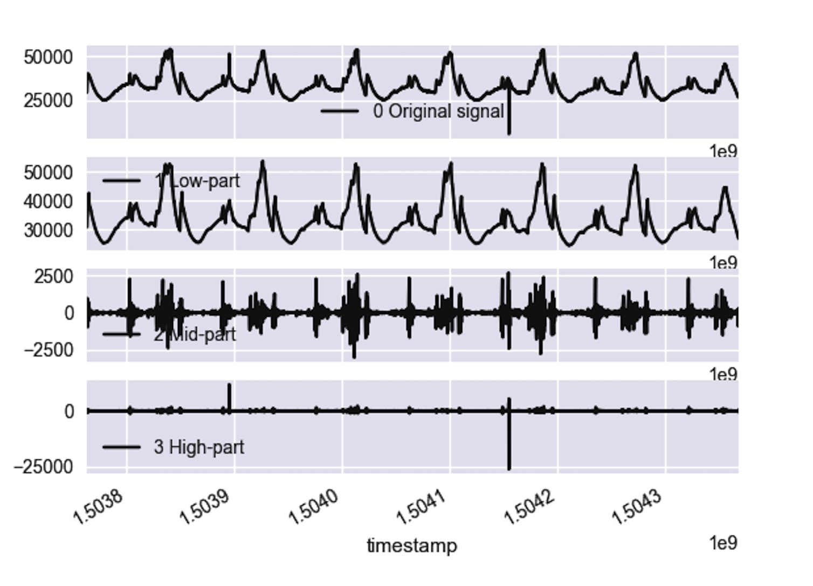
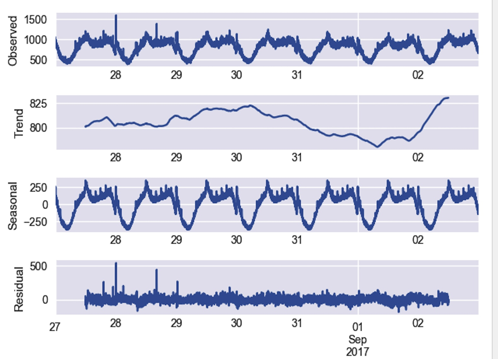
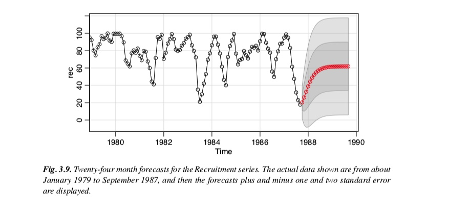

# 引言 
常用的特征提取/特征转换函数可以分为以下几类：
- 简单的统计描述
  - 位置
    - 均值
    - 中位数
    - 分位数（5%，25%，50%，75%，95%等）
    - 最大值
    - 最小值
  - 散度:
    - 标准差
    - 方差
    - MAD
    - 峰度
    - 偏度
  - 序列相关性
    - 自相关系数
    - 偏自相关系数
  
- 基于传统时序模型
  - MA模型
  - AR模型
  - arima模型
  - 时序分解
    - 简单时序分解tsd
    - 简单时序分解stl

- 统计分布
  - GMM模型

- 熵特征
- 频域特征/谱分析
  - 快速傅里叶变换
  - 小波变换
- 拟合特征

## 简单的统计特征

### 均值mean
 均值 mean反应样本中的平均数
 $$\mu = \frac{1}{T} \sum\limits_{t=1}^T x_t$$

### 中位数median
 中位数可将样本中的数值集合划分为相等的两部分，实数 $$ x_{1},x_{2},...,x_{T}$$按大小顺序（顺序，降序皆可）排列为 $${ x'_{1},x'_{2},... ,x'_{n}}$$, 则中位数为

### 众数mode
众数（mode）指一组数据中出现次数最多的数值。在统计学上，众数和平均数、中位数类似，都是衡量总体或随机变量有关平均水平的重要指标。

 ## 分位数quantile
分位数（5%，25%，50%，75%，95%等）

### 几何平均数
几何平均数 是指的观测值的乘积之观测值个数方根，即 $${ (x_{1}\times x_{2}\times x_{3}... \times x_{n})^{\frac {1}{T}}}$$

### 调和平均数 
观测值个数除以观测值倒数的总和，即

### 截尾平均数（truncated mean） 
截尾平均数是指忽略极端值后所得的平均数。例如，四分平均数（interquartile mean）正是忽略前25%前及后75%的数据点后所得的算数平均数。

### 最大值

时间序列中最大值。

### 最小值
时间序列中最小值。

### 标准差
标准差是一种不确定性的度量指标，一个较大的标准差，代表大部分的数值和其平均值之间差异较大；一个较小的标准差，代表这些数值较接近平均值， 他的计算公式：
$$\ SD= \sqrt{\frac{1}{N} \sum\limits_{t=1}^T (x_t - \hat x_t)^2}$$

### 方差(Variance)
方差跟标准差类似，也是一种不确定性的度量指标，， 他的计算公式：
$$\ variance ={\frac{1}{N} \sum\limits_{t=1}^T (x_t - \hat x_t)^2}$$

### 中位数绝对偏差(MAD)
中位数绝对偏差（Median absolute deviation, ）是一种衡量样本差异性的指标。当样本中有极值存在时，mad相对标准差更加鲁棒。

${\displaystyle \operatorname {MAD} =\operatorname {median} \left(\ \left|X_{i}-\operatorname {median} (X)\right|\ \right),\,}$
。

### 峰度
峰度（Kurtosis）衡量实数随机变量概率分布的峰态。峰度高就意味着方差增大是由低频度的大于或小于平均值的极端差值引起的，他的计算公式是：

### 偏度

偏度衡量实数随机变量概率分布的不对称性。偏度分为两种：
[1]负偏态或左偏态：概率密度函数左侧的尾部比右侧的长，分布的主体集中在右侧。
[2]正偏态或右偏态：概率密度函数右侧的尾部比左侧的长，分布的主体集中在左侧。

偏度的计算公式是：

### 振幅（Amplitude）

衡量绝对值大小
Amplitude = (top 5%的中位数– bottom5%的中位数)/2

## 自相关系数
对于时间序列$\{Y_t\}$,在不同时刻t,s($\|s - t \|= k$) $Y_t$和$Y_s$的相关系数为k阶自相关系数$\hat\rho(k)$:

自相关系数反应了时间序列$\{Y_t\}$在不同时刻$Y_t$和$Y_s$之间关联程度

## 偏自相关系数
对于时间序列$\{Y_t\}$,在不同时刻t,s($\|s - t \|= k$) $Y_t$和$Y_s$的条件相关系数为k阶偏自相关系数$\hat p(k)$:

$$\hat p(k) = \frac{ \rho_k -\alpha_{1}\rho_{k-1}-... -\alpha_{k-1}\rho_{1}}{ 1 -\alpha_{1}\rho_{1}-... -\alpha_{k-1}\rho_{k-1}}$$

## 自回归模型(Autoregressive Models)
$AR(p)$模型，假设单条时序数据的取值为$ X_1 ,...,X_t $，

在自回归模型中，t时刻的取值$X_t$,可以用前面一个长度为$p$的窗口的数据来刻画，也就是：

$$X_t = \sum\limits_{i=1}^{p} \phi_i X_{t-i}+ c+\epsilon_t$$

该模型中的回归系数$a_1,...,a_p,c$需要从历史数据中训练得到，可以作为该时间序列的一个特征。

## 滑动平均自回归模型(Autoregressive Moving Average)

滑动平均自回归模型($ARMA(p,q)$) 

$\hat X_{t+1|t} - \mu = \sum\limits_{i=1}^{p} \phi_i (X_{t-i} - \mu)+ \sum\limits_{i=1}^{q} \theta_i \varepsilon_{t-i}+ c $
对arma模型进行参数估计，得到$\phi_i, i = 1,2,...,p$,
和$\varepsilon_j, j=1,2,...,q$,可作为时序特征。

###高斯混合模型(GMM)
对于一些数据，我们用单高斯模型并不能很好的描述，于是引入了混合高斯分布。

高斯混合模型（Gaussian mixture model，简称GMM）是单高斯模型的延伸，GMM 能夠平滑地近似任意形狀的密度分佈。假设x是随机变量,则gmm可以表示为：
$$p(x) = \sum\limits_{k=1}^K \pi_kN(x|\mu_k, \Sigma_k)$$
$$\sum\limits_{k=1}^K \pi_k = 1$$
这里$\pi_k$ 是混合系数（mixture coefficient,$N(x|\mu_k, \Sigma_k)​$是高斯分布的第K个分量,K表示该分布一共有K个分量（Component).
该分布的参数估计方法可以采用EM算法。

二维的GMM(K=2)图示

二维的GMM(K=1)图示

## 熵特征
为什么要研究时间序列的熵呢？请看下面两个时间序列：时间序列（1）：(1,2,1,2,1,2,1,2,1,2,...)时间序列（2）：(1,1,2,1,2,2,2,2,1,1,...)在时间序列（1）中，1 和 2 是交替出现的，而在时间序列（2）中，1 和 2 是随机出现的。在这种情况下，时间序列（1）则更加确定，时间序列（2）则更加随机。并且在这种情况下，两个时间序列的统计特征，例如均值，方差，中位数等等则是几乎一致的，说明用之前的统计特征并不足以精准的区分这两种时间序列。通常来说，要想描述一种确定性与不确定性，熵（entropy）是一种不错的指标。对于离散空间而言，一个系统的熵（entropy）可以这样来表示： 如果一个系统的熵（entropy）越大，说明这个系统就越混乱；如果一个系统的熵越小，那么说明这个系统就更加确定。提到时间序列的熵特征，一般来说有几个经典的例子，那就是 binned entropy，approximate entropy，sample entropy。下面来一一介绍时间序列中这几个经典的熵。
### Binned Entropy

从熵的定义出发，可以考虑把时间序列的取值进行分桶的操作。例如，可以把这个区间等分为十个小区间，那么时间序列的取值就会分散在这十个桶中。根据这个等距分桶的情况，就可以计算出这个概率分布的熵（entropy）。i.e. Binned Entropy 就可以定义为： 其中   表示时间序列 的取值落在第    个桶的比例（概率），  表示桶的个数，  表示时间序列  的长度。如果一个时间序列的 Binned Entropy 较大，说明这一段时间序列的取值是较为均匀的分布在  之间的；如果一个时间序列的 Binned Entropy 较小，说明这一段时间序列的取值是集中在某一段上的
### 近似熵（Approximate Entropy）

回到本节的问题，如何判断一个时间序列是否具备某种趋势还是随机出现呢？这就需要介绍 Approximate Entropy 的概念了，Approximate Entropy 的思想就是把一维空间的时间序列提升到高维空间中，通过高维空间的向量之间的距离或者相似度的判断，来推导出一维空间的时间序列是否存在某种趋势或者确定性。那么，我们现在可以假设时间序列$$\ u(1),u(2),\ldots ,u(N)]$$的长度是N，同时 Approximate Entropy 函数拥有两个参数m与r，下面来详细介绍 Approximate Entropy 的算法细节。

Step 1. 固定两个参数，正整数m 和正数r，正整数m是为了把时间序列进行一个片段的提取，m表示片段的长度。正数r是表示时间序列距离的某个参数。i.e. 需要构造新的m维向量如下：  

$$\mathbf {x} (1),\ldots ,\mathbf {x} (N-m+1)​$$, 其中第i个片段为

![\mathbf {x} (i)=[u(i),u(i+1),\ldots ,u(i+m-1)]](https://wikimedia.org/api/rest_v1/media/math/render/svg/7a381f13040d6ff5c56e21221c91f04efb6820f3).

Step 2. 通过新的向量$$\mathbf {x} (1),\ldots ,\mathbf {x} (N-m+1)​$$，可以计算出哪些向量较为相似。在这里，距离函数$$d[x,x^{*}]​$$,可以选择无穷范数, 即

 $$d[x,x^{*}]=\max _{a}|u(a)-u^{*}(a)|$$

$$\displaystyle C_{i}^{m}(r)$$ 表示跟$$\mathbf {x} (i)$$相似的向量占所有向量的比例，可以解读为“合群”的程度。

$${\displaystyle C_{i}^{m}(r)=({\text{number of }}x(j){\text{ such that }}d[x(i),x(j)]\leq r)/(N-m+1)\,}$$

Step 3. 考虑函数

$${\displaystyle \Phi ^{m}(r)=(N-m+1)^{-1}\sum _{i=1}^{N-m+1}\log(C_{i}^{m}(r))}$$,

表示所有新向量跟其他成员相似度的平均值。

Step 4. Approximate Entropy 可以定义为： 

$$\mathrm {ApEn} =\Phi ^{m}(r)-\Phi ^{m+1}(r).​$$

Remark.正整数m一般可以取值为 2 或者 3， 会基于具体的时间序列具体调整；如果某条时间序列具有很多重复的片段（repetitive pattern）或者自相似性（self-similarity pattern），那么它的 Approximate Entropy 就会相对小；反之，如果某条时间序列几乎是随机出现的，那么它的 Approximate Entropy 就会相对较大。

### 样本熵（Sample Entropy）

除了 Approximate Entropy，还有另外一个熵的指标可以衡量时间序列，那就是 Sample Entropy，通过自然对数的计算来表示时间序列是否具备某种自相似性。按照以上 Approximate Entropy 的定义，可以基于  与    定义两个指标    和  ，分别是  其中， 表示集合的元素个数。根据度量   （无论是   ）的定义可以知道  ，因此 Sample Entropy 总是非负数，i.e. Remark.Sample Entropy 总是非负数；Sample Entropy 越小表示该时间序列具有越强的自相似性（self similarity）。通常来说，在 Sample Entropy 的参数选择中，可以选择

## 频域特征 

将时间序列表达成一系列不同频率的正弦函数和余弦函数线性组合的形式，考察分析不同频率成分的重要性，这种分析方式叫频域分析或者谱分析。其中傅里叶分析和小波分析是频域分析最基础的算法。
  - 傅里叶级数
  - 小波分析

### 傅里叶变换
对于一个时间序列$\{X_t\}$，有离散傅里叶变换函数${\displaystyle f_{\omega}}$:

$$f_w = \sum\limits_{t=0}^{T-1} X_{t+1} e^{(-i2\pi/N)tn} \qquad \omega = 0,...,T-1$$

然而傅里叶分析是将三角函数作为基函数，刻画的是整体而非局部频率成分，基于此，小波分析引入了窗函数概念，弥补了傅里叶变换无法处理非平稳性数据的局限性。

### 小波分析
小波分析引入了窗函数$\psi(t)$:
${\displaystyle \psi _{m,n}(t)={\frac {1}{\sqrt {a^{m}}}}\psi \left({\frac {t-nb}{a^{m}}}\right).}$
对应的小波系数为：
$$X_{\psi}(b, a) = \int ^{+\infty}_{-\infty} X_t \psi_{b,a}dt$$

$a$表示尺度(scale)或者膨胀参数参数。
$b$表示平移参数.
b表示小波窗口在时间轴上的位置，实现函数的平移，当a减少时，$\psi_{b,a}$在时间上减少了，而覆盖的频域范围变大了。
常用的小波函数$\psi(t)$有Shannon函数与Daubechies小波函数等，

下图是使用小波变换将原始时序分解成高中低频三个信号：

# 拟合特征
## 时间序列分解tsd
传统的时间序列分解算法将时间序列分解成三个成分：
$X_t = S_t + T_t + R_t$
趋势性$T_t$: 表示时序的长期趋势.
季节性$S_t$: 表示数据以一个相当规律的时间间隔，周而复始地重复之前的波动性为，常伴随波峰与波谷。
误差项$R_t$: 原始时序剔除掉趋势性和季节性后剩下的成分，这部分是随机项。

通过将时序分解成确定+不确定的成分，可以实现对未来的预测。

## STL分解
$X_t = S_t + T_t + R_t$
### 季节性指数
$$1 - \frac{Var(R_t)}{Var(X_t - T_t)}$$

### 趋势性指数
$$1 - \frac{Var(R_t)}{Var(X_t - S_t)}$$

### 谱熵

## 滑动平均自回归模型(Autoregressive Moving Average)

滑动平均自回归模型($ARMA(p,q)$) 

$\hat X_{t+1|t} - \mu = \sum\limits_{i=1}^{p} \phi_i (X_{t-i} - \mu)+ \sum\limits_{i=1}^{q} \theta_i \varepsilon_{t-i}+ c $

前s期的预测值为
$\varepsilon_{t}  = X_t - \hat X_{t|t-1}$
${\displaystyle \mathrm {\hat X_{t+s|t}} ={\begin{cases} 
\sum\limits_{i=1}^p\phi_i\hat x_{t+s-i|t} +  
\sum\limits_{i=s}^q\theta_i\hat \varepsilon_{t+s-i|t} 
,&{\mbox{if }}s =1,2,...,q\\{
}\sum\limits_{i=1}^p\phi_i\hat x_{t+s-i|t},
&{\mbox{if }}s = q+1,q+2 ...,\end{cases}}}$
其中
$\hat X_{\tau|t} = X_{\tau}, \tau<=t$

下图是arima预测的效果图

$\left| x \right|$

[参考文献]
https://zh.wikipedia.org/wiki/%E4%B8%AD%E4%BD%8D%E6%95%B8
https://zh.wikipedia.org/wiki/%E9%9B%86%E4%B8%AD%E8%B6%8B%E5%8A%BF
https://en.wikipedia.org/wiki/Median_absolute_deviation
https://en.wikipedia.org/wiki/Wavelet
https://www.slideshare.net/hyndman/exploring-the-feature-space-of-large-collections-of-time-series

