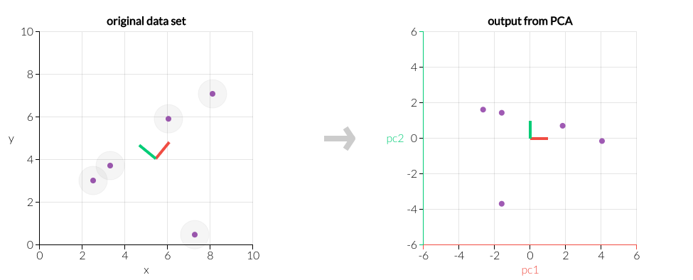

# 场景可视化
## 算法说明

主成分分析是一种常用的降维的方法。通过对变量（特征）数目进行一定程度的缩减，在不丢失绝大多数信息的前提下尽可能的生成解释力更强的特征，同时去除不必要的特征。

## 算法原理-参数
- n_components:提取主成份维度	,int，float，None或string,指定希望PCA降维后的特征维度数目。

（1）当n_components是一个大于等于1的整数，直接指定降维到的维度数目；

（2）当n_components是一个（0，1]之间的数，可以指定主成分的方差和所占的最小比例阈值，让PCA类自己去根据样本特征方差来决定降维到的维度；

（3）当n_components="mle", 此时PCA类会用MLE算法根据特征的方差分布情况自己去选择一定数量的主成分特征来降维；

（4）默认值为None,此时n_components=min(样本数，特征数)。

## 输入输出概览

# 算法原理可视化-交互式

2维空间的例子
在下面的交互图中，拖拽左图上的数据点，可以看到右图中对应的主成分方向上，数据点的分布。

<!--  -->

左图：原始数据点的分布图。

右图：利用PCA将数据从原来的x,y轴坐标系投影到新的坐标系pc1,pc2后，数据点的分布图。

降维：可以通过查看pc1,pc2维度上的方差大小，来衡量pc1,pc2维度的重要性，从而选取较重要的特征作为新的特征。如果要将数据降到1维，我们可以选择pc1，这样就不会丢失太多原始的信息量，因为pc1维度上的方差最大，在数据集中对方差的贡献最大，最重要。
