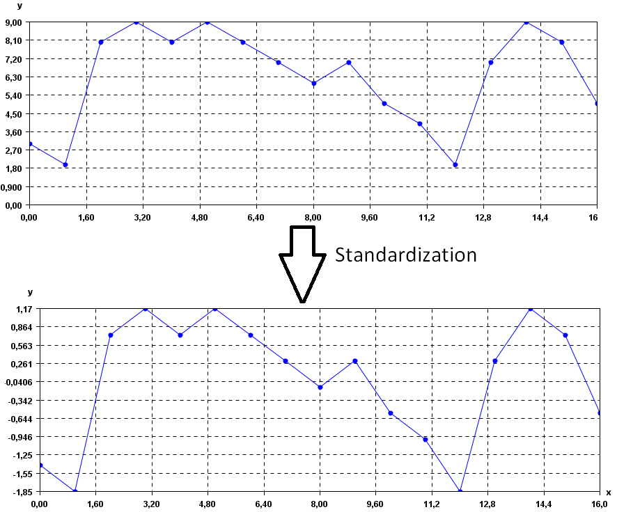

# 场景可视化

## 算法说明
将实际的值区间转换为标准的值区间（通常为 -1 到 +1 或 0 到 1）的过程。例如，假设某个特征的自然区间是 800 到 6000。通过减法和除法运算，您可以将这些值标准化为位于 -1 到 +1 区间内。

## **参数**
- "method": 归一化的方法可选项为MinMaxScaler,StandardScaler,RobustScaler， 默认值是RobustScaler
- "with_centering":bool类型,是否需要做中心化，默认值是True。
- "with_std": bool类型，是否需要对方差做归一化，默认值是True。

## 输入输出数据预览

输入数据预览如下：

| timestamp     | value | label |
|---------------|-------|-------|
| 2017/8/6 0:00 | 65013 | 0     |
| 2017/8/6 0:01 | 64492 | 0     |
| 2017/8/6 0:02 | 64058 | 0     |
| 2017/8/6 0:03 | 63587 | 0     |
| 2017/8/6 0:04 | 63085 | 0     |

经过标准化处理之后的列为outputCol，输出数据预览如下：

| timestamp     | value | label | outputCol |
|---------------|-------|-------|-----------|
| 2017/8/6 0:00 | 65013 | 0     | -0.008882 |
| 2017/8/6 0:01 | 64492 | 0     | -0.014877 |
| 2017/8/6 0:02 | 64058 | 0     | -0.01987  |
| 2017/8/6 0:03 | 63587 | 0     | -0.02529  |
| 2017/8/6 0:04 | 63085 | 0     | -0.031065 |

# 原理可视化

下图中，第一个图是原始的时序图，横轴表示时间，纵轴表示取值，可以看到原始的区在在180~900之间。
经过标准化之后，这根曲线的取值会集中在0附近。

做标准化处理，就是对曲线的值进行缩放，落入同一个量岗范围，从而使得不同的曲线都具有可比性。

"method": 归一化的方法可选项为MinMaxScaler,StandardScaler,RobustScaler.
  - MinMaxScaler方法表示对特征数据进行统一的归一化处理，默认归一化后的特征数值范围在[0,1]。 该归一化的计算公式为：
    $$\frac{x-min}{max-min}$$

  - StandardScaler算法主要对特征进行标准化处理，原始特征数据通过该算法的转化将成为方差为1，均值为0的新的特征。计算公式为：

    $$\frac{x-Mean}{Var}$$
