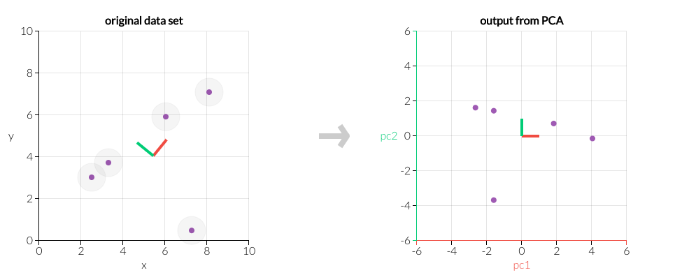

# 算法原理-文档

主成分分析是一种分析、简化数据集的技术。主成分分析经常用于减少数据集的维数，同时保持数据集中的对方差贡献最大的特征。这是通过保留低阶主成分，忽略高阶主成分做到的。这样低阶成分往往能够保留住数据的最重要模式。

# 算法原理可视化-交互式

2维空间的例子
在下面的交互图中，可以看到拖拽这点数据点，对应的主成分方向上，数据点的分布。

# 算法原理-参数

K:主成分个数。

