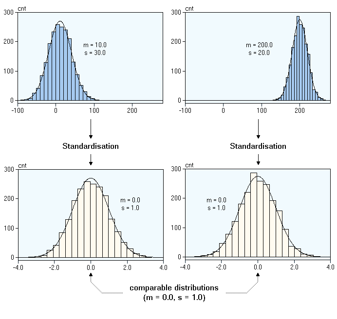

#标准化

将实际的值区间转换为标准的值区间（通常为 -1 到 +1 或 0 到 1）的过程。例如，假设某个特征的自然区间是 800 到 6000。通过减法和除法运算，您可以将这些值标准化为位于 -1 到 +1 区间内。

## 场景可视化

下图中，第一个图是原始的时序图，横轴表示时间，纵轴表示取值，可以看到原始的区在在180~900之间。
经过标准化之后，这根曲线的取值会集中在0附近。
做标准化处理，就是对曲线的值进行缩放，落入同一个量岗范围，从而使得不同的曲线都具有可比性。

## 原理可视化

## **参数**

- "method": “minmax"和"standard"分别代表了相应的归一化方法MinMaxScaler和StandardScaler。
  - MinMaxScaler方法表示对特征数据进行统一的归一化处理，默认归一化后的特征数值范围在[0,1]。 该归一化的计算公式为：

    $$\frac{x-EMin}{EMax-EMin}$$

  - StandardScaler算法主要对特征进行标准化处理，原始特征数据通过该算法的转化将成为方差为1，均值为0的新的特征。计算公式为：

    $$\frac{x-Mean}{Var}$$

  其中，Mean代表该特征的平均值，Var表示该特征的样本标准差。以下的特殊情况应该**注意**:
    (1)如果Var为0，则x标准化后的结果直接为0.0
    (2)不需要均值化处理：此时算法只做方差处理，即：x/Var
    (3)不需要方差处理:x直接取值(x-Mean)

  - "min":归一化后的最小值
  - "max":归一化后的最大值
  - "std":是否需要做方差的标准化
  - "mean":是否需要做均值的标准化
