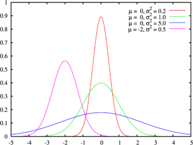

# 高斯分布检测算法

##  算法原理-句话说明

高斯分布检测算法的原理是：假设原始数据服从高斯分布，则落入分布中稀疏区域的点为异常点。

##  算法原理-文档

如果随机变量X服从均值为$$\mu$$，方差为$$\sigma^2$$的高斯分布，即
X～$$N(\mu,\sigma^2)$$高斯分布,则高斯分布的密度函数为:

$$f ( x ) = \frac { 1 } { \sqrt { 2 \pi } \delta } e ^ { - \frac { ( x - u ) ^ { 2 } } { 2 } }$$

该分布图以$$x=\mu$$对称，$$\sigma$$决定了曲线的陡峭程度，如下图所示：

当样本特征服从高斯分布，我们可以用正态分布来对数据进行异常检测，流程可以分为三步：
（1）特征选择：符合高斯分布或能转换为高斯分布的特征；
（2）参数估计：计算数据分布的均值和方差；
（3）异常诊断：选定阈值$$\epsilon$$，把概率密度函数值小于某个阈值的点判定为异常，即$$f(x)<\epsilon$$的点诊断为异常点。$$\epsilon$$可以动态选择。例如经典的3-sigma方法是选取了累积概率密度函数约为99.7%时对应的数值，我们也可依据先验经验，确定N-sigma中N的取值值来确定阈值.不同的n对应着不同的正常值比例。
上界：
$$UCL = \mu+N*\sigma$$
下界：
$$LCL = \mu-N*\sigma$$

如下图：

## 算法原理-参数

**标准差倍数**：取值范围为[1,n],	标准差倍数决定了正常值占总数的比例。标准差倍数越大，正常值占比越大，异常值占比越小。1倍，2倍，3倍标准差决定的正常值比例分别为68%，95%，99.7%。

**阈值**：设定应用阶段敏感度$$\epsilon$$为N-sigma中的n，则异常检测的上界为$$\mu+\epsilon*\sigma$$,下界为$$\mu-\epsilon*\sigma$$，中间线为均值$$\mu$$。当数据超过上下界范围时，就被检测为异常点。敏感度越小，上下界越靠近中线，正常值比例越低，异常值比例越高。

## 场景可视化-交互式

如下图所示，滚动条的值是检测算法的N，对应异常分值的阈值，灰色区域是检测算法的正常区间，红色点是检测出的异常点。

向右拖动滚动条时，对应检测算法的N值变大，上下界更宽松，意味着更少的点被划分到异常区间。

可以看到右图-概率密度图中，异常区域变小，即更多的样本点落在了正常区间中。

使用：设定敏感度为n-sigma中的n，则异常检测的上界为$$\mu+n*\sigma$$,下界为$$\mu-n*\sigma$$，中间线为均值$$\mu$$。当数据超过上下界范围时，被检测为异常点。

向右拖动敏感度，敏感度n变大，上下界远离中线，异常点占比减少。

