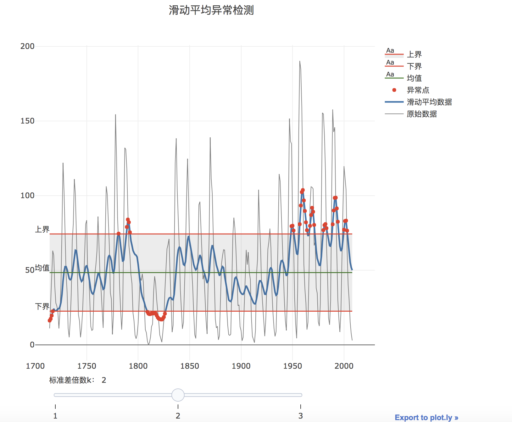
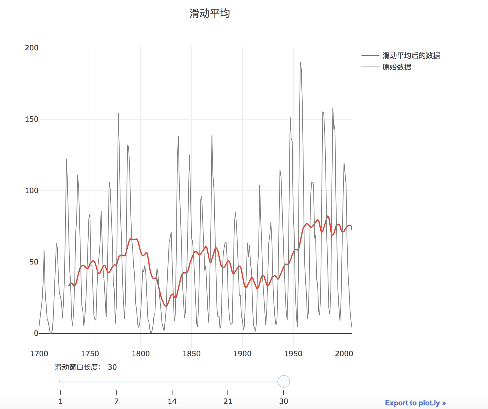

# 滑动平均(MA)检测算法

##  算法原理-句话说明

MA是滑动平均的简称，该方法也是异常检测的一个常用算法。原理是先对原始时序进行滑动平均，得到下一个时刻的置信区间（也就是上下界），当下一个样本点超出置信区间，则判断为异常。

## 算法原理-文档

MA是滑动平均的简称，该方法也是异常检测的一个常用算法。原理是先对原始时序进行滑动平均，得到下一个时刻的置信区间（也就是上下界），当下一个样本点超出置信区间，则判断为异常。

算法主要步骤为：

（1）**滑动平均**

计算方法：对于一个给定的数列，首先设定一个固定的滑动窗口长度w，然后分别计算第1项到第w项，第2项到第w+1项，第3项到第w+2项的平均值，依次类推。

（2）**异常检测**

在对原始数据进行滑动平均后，异常检测的上下界为：

上界：$$UCL =\mu_0+\frac{k\sigma}{\sqrt{w}}$$

下界：$$LCL =\mu_0-\frac{k\sigma}{\sqrt{w}}$$

当数据超过上下界范围时，就被检测为异常点。其中$$\mu_0$$为历史数据的均值,$$\sigma$$为历史数据的标准差，$$w$$为滑动窗口的长度，$$k$$为常量，一般取值为3。$$k$$的取值决定了上下界的范围及异常值的比例。$$k$$越小，上下界越靠近中线，正常值比例越低，异常值比例越高。

## 算法原理-参数

1. 滑动窗口长度$$w$$:$$w$$越大，噪声被去除的就越多，得到的信号就越平稳；但同时，信号的有用部分丢失原有特性的可能性就越大。
2. 敏感度$$\epsilon$$:等于标准差倍数$$k$$，则异常检测的上界为$$\mu_0+\frac{k\sigma}{\sqrt{w}}$$，下界为$$\mu_0-\frac{k\sigma}{\sqrt{w}}$$中间线$$\mu=\mu_0$$,即历史数据的均值，$$\sigma$$为MA的标准差，$$w$$为滑动窗口的长度。当数据超过上下界范围时，就被检测为异常点。敏感度越小，上下界越靠近中线，正常值比例越低，异常值比例越高。

## 场景可视化-交互式

## 算法原理可视化-交互式

