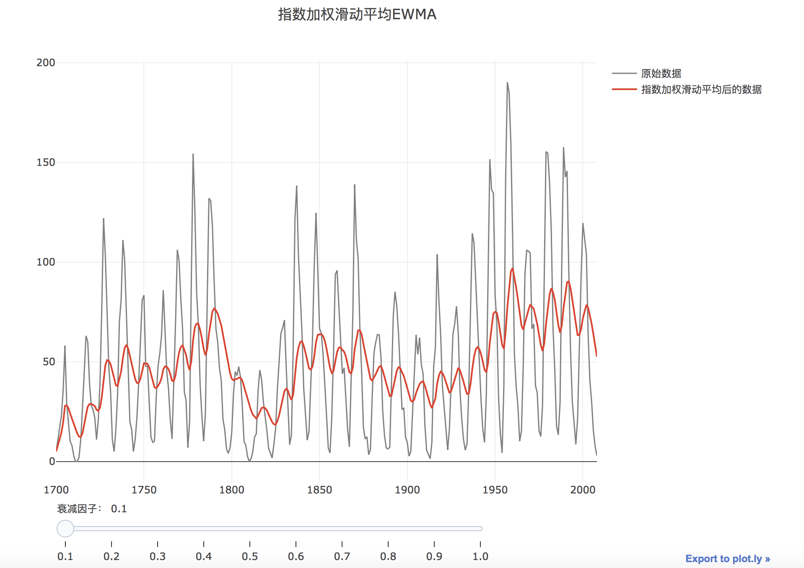

# 指数加权滑动平均(EWMA)检测算法

## 算法原理-句话说明

指数加权滑动平均(EWMA)检测算法原理是,先对原始时序进行指数平滑，得到下一个时刻的置信区间（也就是上下界），当下一个样本点超出置信区间，则判断为异常。

## 算法原理-文档

EWMA是指数加权滑动平均的简称，该方法也是异常检测的一个常用算法。原理是先对原始时序进行指数平滑，得到下一个时刻的置信区间（也就是上下界），当下一个样本点超出置信区间，则判断为异常。主要步骤为：


（1）**指数平滑**

对数据进行指数平滑处理，处理公式为：$$EWMA_t=\lambda Y_t+(1-\lambda)EWMA_{t-1}$$，其中：

- $$EWMA_0$$是历史数据的均值；
- $$Y_t$$是t时刻的观测值；
- n是数据总量；
- $$\lambda$$是一个参数，决定算法对历史数据的依赖程度， $$0<\lambda<1$$。$$\lambda$$越接近于1，历史数据的权重越小，当前时刻的权重越大。

（2）**异常检测**

EWMA 的估算方差为，$$s^2_{ewma}=\frac{\lambda}{2-\lambda}s^2$$,其中s为历史上历史数据的标准差；

则异常检测的上下界为：

上界：
$$UCL =EWMA_0+k*s_ {ewma}$$

下界：
$$LCL =EWMA_0-k*s_{ewma}$$

当数据超过上下界范围时，就被检测为异常点。其中$$k$$为常量，一般取值为3。$$k$$的取值决定了上下界的范围及异常值的比例。$$k$$越小，上下界越靠近中线，正常值比例越低，异常值比例越高。

下面举例说明计算过程:

**数据预览**：

```
52.0 47.0 53.0 49.3 50.1 47.0
51.0 50.1 51.2 50.5 49.6 47.6
49.9 51.3 47.8 51.2 52.6 52.4  53.6 52.1
```

**指数平滑**：

$$EWMA_0$$=50，选择$$\lambda=0.3$$,对数据进行指数平滑后，数据为：

```
50.00 50.60 49.52 50.56 50.18
50.16 49.21 49.75 49.85 50.26
50.33 50.11 49.36 49.52 50.05
49.38 49.92 50.73 51.23 51.94 51.99
```

**异常检测**：

$$s^2_{ewma}=\frac{\lambda}{2-\lambda}s^2=\frac{0.3}{2-0.3}*2.0539$$,，则$$s_{ewma}=0.6039$$,则上下界为：

$$UCL=50+3(0.4201)(2.0539)=52.5884$$

$$LCL =50-3(0.4201)(2.0539)=47.4115$$

效果图如下：


## 算法原理-参数

衰减因子$$\lambda$$:其值介于0与1之间﹐表示EWMA对于历史量测值之权重系数。$$\lambda$$越接近于1，历史数据的权重越小，当前时刻的权重越大。

敏感度:设定应用阶段敏感度$$\epsilon$$等于标准差倍数$$k$$，则异常检测的上界为$$\mu+\epsilon*\sigma$$,下界为$$\mu-\epsilon*\sigma$$，中间线$$\mu=EWMA_0$$,即历史数据的均值，$$\sigma$$为EWMA的标准差。当数据超过上下界范围时，就被检测为异常点。敏感度越小，上下界越靠近中线，正常值比例越低，异常值比例越高。


## 场景可视化-交互式


## 算法原理可视化-交互式





