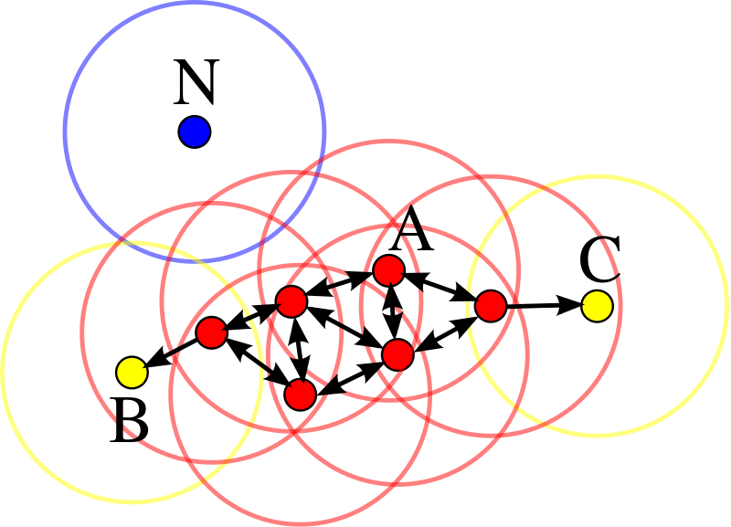
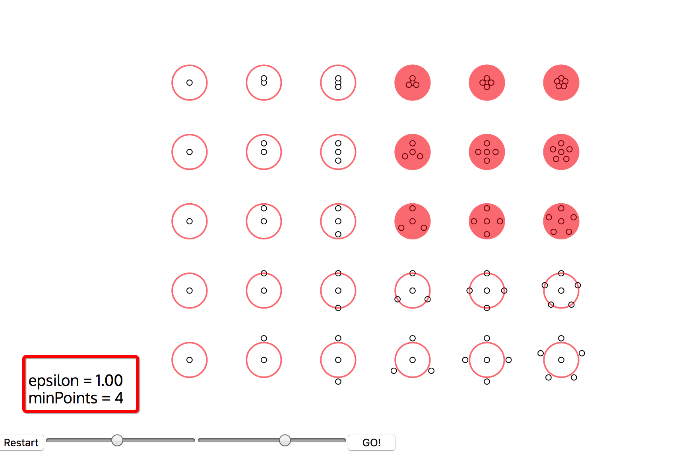
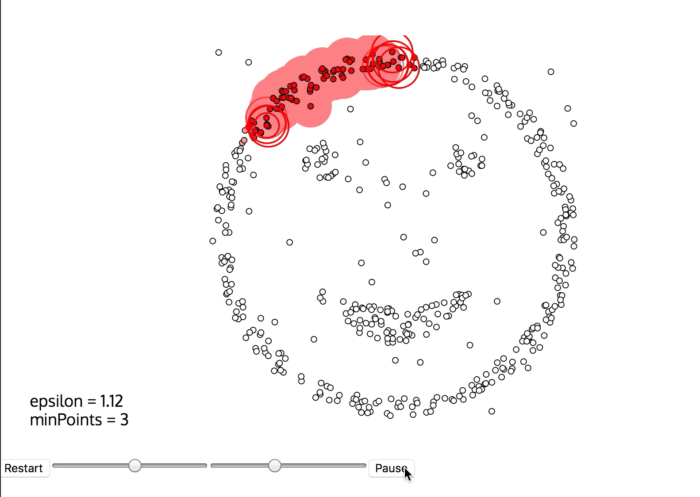
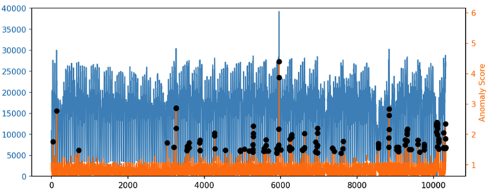

# 算法原理-句话说明

DBSCAN算法用作异常检测的原理是，在聚类过程中通过寻找核心点来扩展类簇边界，得到样本空间中不同的高密度区域，而没有落入高密度区域的样本点就被视为异常点。

# 算法原理-文档

DBSCAN算法用作异常检测的原理是，在聚类过程中通过寻找核心点来扩展类簇边界，得到样本空间中不同的高密度区域，而没有落入高密度区域的样本点就被视为异常点。

具体来说,DBSCAN算法将样本点定义为三种类型：

- 核心点（core points)：下图中的红色点，满足$$\epsilon $$邻域内的邻居个数超过minPoints。
- 边缘点（border points）：类簇边缘的点。
- 异常点(outliers): 如果某个点附近不存在可达点，那就定义为异常点，下图中的蓝色点。

聚类，即构造类簇的过程如下：
- 查找每个数据点的 $$\epsilon-$$ 邻居，并且标记core points。.
- 在图中查找连接起来的core points，忽略掉non-core points。
- 如果non-core point最近的类簇是$$\epsilon-$$邻居，就把non-core point分配给该类簇，否则它就是噪声。

算法判断新样本点是否异常的原理是：如果在某类中存在样本点，使得新的样本点位于该样本点的$$\epsilon$$邻域内，那么新样本点就属于这个类簇。不属于任何一类的样本点，就是噪声点或者异常点.

# 算法原理-参数

- epsilon: 邻域的大小。
- minPoints: core-point附近邻居的个数.
     

# 算法原理可视化-交互式

下图是DBSCAN算法可视化的例子(由meifan提供),  通过交互图展示训练过程可视化和训练结果。

如下图所示   

点击"run"就开始进入训练过程可视化。

# 场景可视化-交互式

针对时间序列异常检测场景，该算法可以输出每个时刻的异常程度以及是否异常的结果。
如下图所示，横轴表示时间，蓝色的周期性波动曲线表示检测的指标，
橙色的曲线表示算法输出的该时刻曲线取值的异常程度
黑色的点表示算法检测出来的异常点，可以看到，当橙色的曲线上的点即异常分值超过了某个阈值之后，
该时刻的点就被判断为异常。

