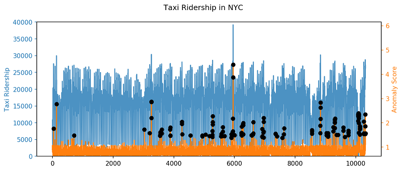

## 算法原理-句话说明
随机森林(Random Forest）通过对多颗决策树进行集成，从而进行预测的算法。

## 算法原理-文档
随机森林(Random Forest）通过对多颗决策树进行集成，从而进行预测的算法。
在构造多颗决策树的时候，随机森林采用bagging的方法。

## 算法原理-参数
- n_estimators: 树的颗数，取值越大，拟合效果越好，但是计算时间长度会增加。同时，超过一定取值后会产生过拟合。
- max_features： 分割节点时考虑的特征的随机子集的大小。 这个值越低，方差减小得越多，但是偏差的增大也越多。max_features 的默认取值为sqrt（特征的个数）。
- n_jobs: 并行数，表示计算被划分为n_jobs个作业，并运行在机器的n_jobs 个核上。 如果设置 n_jobs = -1 ，则使用机器的所有核。 

## 场景可视化-交互式

该算法出处的检测

